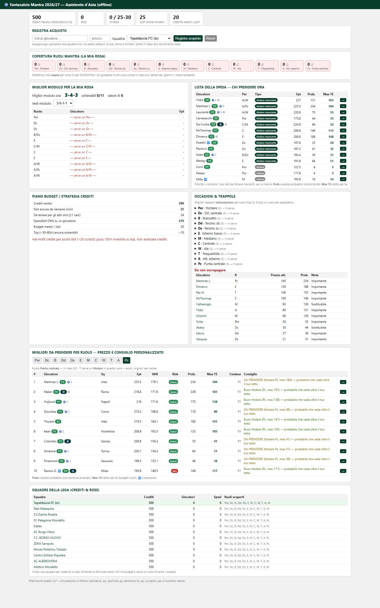

# Fantacalcio Mantra Auction Optimizer

A quantitative decision-support system for the **Italian fantasy football (Fantacalcio) auction** —
built end-to-end with **[Claude Code](https://www.anthropic.com/claude-code)** (Anthropic).

It combines **machine learning**, **statistical modeling** and **combinatorial optimization** to
answer the questions that actually decide a fantasy auction:

- How many fantasy points will each player realistically score **this season**?
- What is the **rational maximum price** to pay for a player, given the budget and the market?
- Which **squad** maximizes expected points within the budget and the roster rules?
- Which **Mantra formation (module)** is statistically the best for the squad you can build?
- **Live during the auction:** who to target next, at what price, and how it changes as players
  are bought by the 12 managers.

> Built for a 12-team **Mantra** league (500 credits, 25–30 players), but the same logic is fully
> **reproducible** for **Classic** mode, a different number of managers, a different budget, and
> other seasons — see [Reproducibility](#reproducibility). Everything is parameterized in
> `src/config.py`.



---

## What it produces

- **Player projections** — expected appearances, fantamedia, goals, assists, and total season
  fantasy points, each with an uncertainty band (pessimistic / median / optimistic) and a risk
  score.
- **Economic value** — *Value Above Replacement (VAR)* per Mantra role, an **expected auction
  price** (not the official market value), value-for-money, and a recommended **max bid**.
- **Optimal squad + best module** — an Integer Linear Program picks the best roster within the
  budget and evaluates **every legal Mantra module**, then reports which one lets you build the
  strongest overall squad.
- **A live, offline auction dashboard** (`dashboard/auction_dashboard.html`, single self-contained
  file) — see below.
- **Reports** — a full Markdown report, a multi-sheet Excel ranking, a Monte-Carlo auction-strategy
  brief, and a printable **expected-standings PDF**.

### The live auction dashboard
A **prebuilt copy for this league is included** at `dashboard/auction_dashboard.html` (open it directly in a browser). Regenerate your own with `python src/build_dashboard.py`.

A single HTML file that runs offline (just double-click). During the auction it:

- tracks purchases **per real team** (all 12 managers) with the price paid;
- keeps your **remaining budget**, roster, and **role coverage** for all Mantra roles up to date;
- shows, for **each Mantra role**, the best available players with a **dynamic max bid** that
  adapts to your remaining credits, the slots you still need, and **who else is still bidding**
  (competition-aware pricing);
- gives every player a **0–100 buyability index** and a personalized verdict
  (*take him / good starter / reserve only / avoid*), including a **quality-aware "starter vs
  reserve" logic** (buying a weak backup first does not block the role);
- auto-suggests the **best module** and best XI from the players you currently own;
- factors in **injuries** and **probable line-ups / penalty & set-piece takers**.

---

## How it works (pipeline)

Each stage is a small, documented Python module in `src/`. Run the whole thing with
`python src/run_all.py`.

1. **`config.py`** — every tunable parameter: budget, participants, roster limits, Mantra roles &
   module→slot maps, scoring rules, risk weights, price calibration, league teams.
2. **`audit.py`** — data audit: structure, coverage, missing values, cross-season ID consistency,
   anomalies, and an explicit list of *missing fields* (nothing is invented).
3. **`preprocess.py`** — clean & merge all historical seasons by player ID; parse multi-role
   Mantra positions; detect players new to the league.
4. **`newcomers.py`** — for players with no domestic history, enrich prior-league stats from the
   web (with confidence flags) and translate them via league-strength coefficients; conservative,
   flagged priors otherwise.
5. **`features.py`** — leak-free temporal features (lagged 1–2 seasons, per-appearance rates,
   trends, team strength, role, newcomer flags).
6. **`model.py`** — component models (expected appearances × fantamedia) with **temporal
   validation** (train on past season-transitions, test out-of-sample on the most recent one),
   model comparison (baseline vs Ridge vs gradient boosting), quantile uncertainty and a composite
   risk score. The best out-of-sample model is chosen — not the most complex.
7. **`value.py`** — VAR per role, expected price (calibrated to the league's real spending),
   value/price, max bid, buyability. Also folds in **injuries** and **probable-lineup** signals.
8. **`optimize.py`** — ILP (PuLP/CBC): best squad within budget + **statistical module selection**
   across all legal Mantra modules.
9. **`auction.py`** — dynamic in-auction recompute (CLI reference for the dashboard's heuristic).
10. **`montecarlo.py`** — simulates opponents to flag indispensable players, value picks and
    overpay traps.
11. **`report.py` / `build_dashboard.py` / `analyze_rosters.py`** — reports, the live dashboard,
    and post-auction squad/standings analysis.

**Methodology principles:** temporal validation (no data leakage), no invented data (missing fields
are declared), everything configurable, predictions separated from optimization.

---

## Reproducibility

The same engine works for other setups by changing `src/config.py` (and dropping in the relevant
data exports):

- **Classic mode** — set the module/role model to the classic roles (P/D/C/A) and classic roster
  (e.g. 3-8-8-6): Classic is essentially the Mantra engine with coarser roles and simpler modules.
  Adjust `MANTRA_ROLES`, `MANTRA_MODULES`/roster bounds and `SCORING`.
- **Different number of managers** — set `N_PARTICIPANTS`; it drives the total credit pool, the
  replacement level, competition-aware pricing and the Monte-Carlo simulation.
- **Different budget / roster size** — `BUDGET`, `ROSTER_MIN`, `ROSTER_MAX`, per-role depth.
- **Different / more seasons** — historical stat files are **auto-discovered** by filename pattern,
  so more seasons just improve the temporal validation.
- **Different scoring rules** — `SCORING` (bonus/malus) is fully parameterized.

---

## Quickstart

```bash
pip install -r requirements.txt
# place your Fantacalcio.it exports (season stats + current quotazioni) in the project root
python src/run_all.py
# then open dashboard/auction_dashboard.html (double-click, works offline)
```

Optional analyses:

```bash
python src/analyze_rosters.py           # expected standings + your best XI from final rosters
python src/make_ranking_pdf.py          # printable expected-standings PDF
python src/auction.py --buy "Barella=45" --other "Lautaro"   # CLI what-if
```

## Repository structure

```
src/            all pipeline modules + dashboard/report generators (see pipeline above)
data/           processed datasets (generated) and external enrichment
outputs/        report, Excel ranking, module comparison, standings PDF, model metrics
dashboard/      auction_dashboard.html (generated, self-contained, offline)
notebooks/      walkthrough.ipynb
requirements.txt
```

## Data & disclaimer

- **Data is user-provided.** You supply your own **Fantacalcio.it** season statistics and current
  `quotazioni` exports; place them in the project root (auto-discovered). Those datasets are
  **© Fantacalcio.it / Fantacalcio®** — respect their terms; they are **not redistributed** here.
- Newcomer enrichment reads publicly available prior-league stats (e.g. FBref/Transfermarkt) with
  per-player confidence flags.
- Projections are **estimates**, not guarantees. This is a personal, educational decision-support
  tool with no affiliation to Fantacalcio.it, Fantalab, or any league provider.

---

*Designed and implemented with **Claude Code** — from the initial data audit through modeling,
optimization, and the live auction dashboard.*
